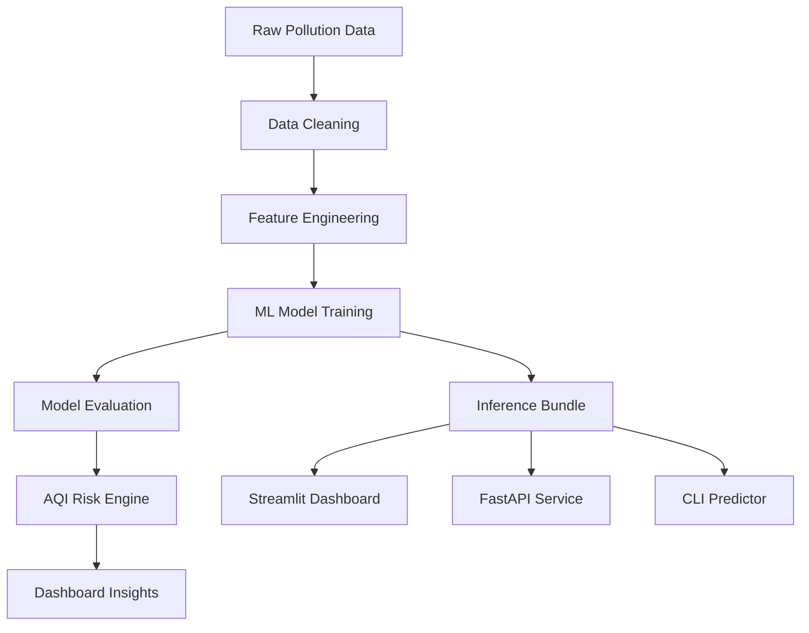
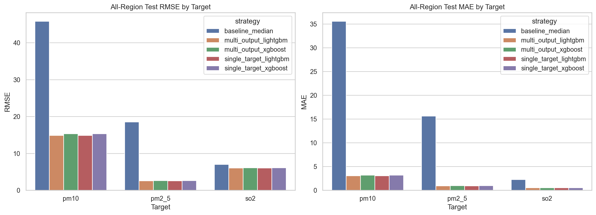
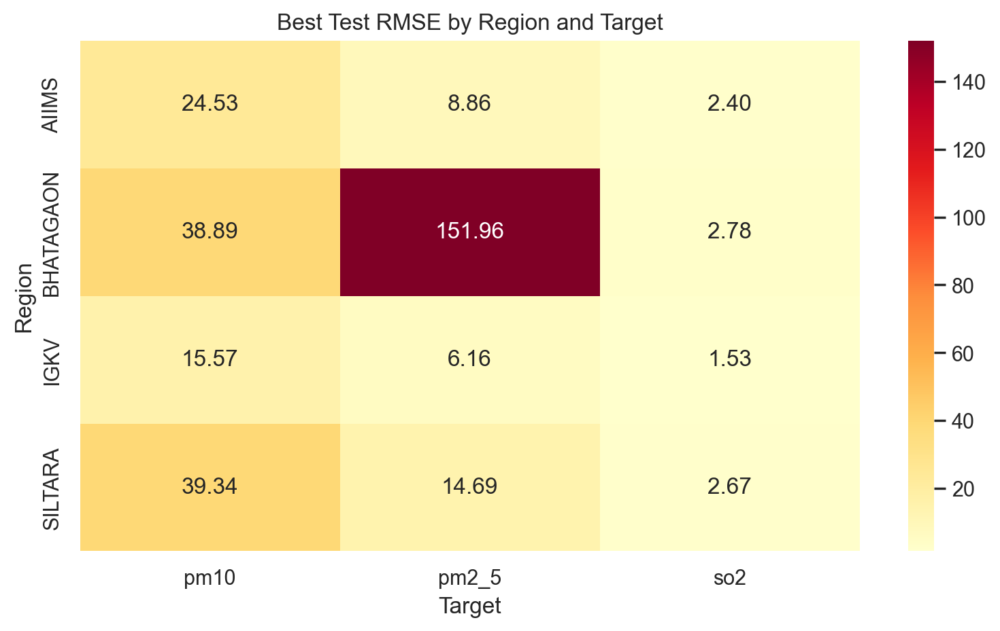
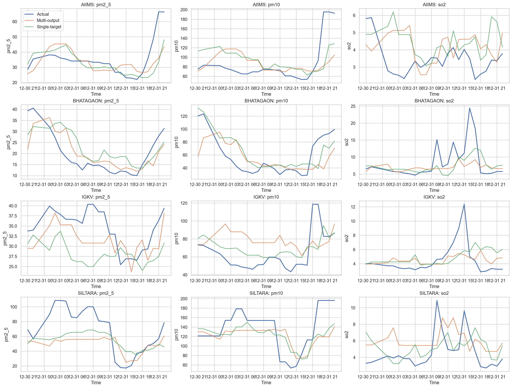

# AirSense AI - Air Pollution Forecasting & Risk Analytics Dashboard


## Overview

AirSense AI is an end-to-end machine learning dashboard that predicts PM2.5, PM10, and SO2 levels using multi-region air-quality monitoring data. It includes preprocessing, feature engineering, model evaluation, AQI risk interpretation, region-level analysis, explainability, anomaly detection, and a deployable dashboard/API layer.

This project is positioned as an **Air Pollution Forecasting & Risk Analytics System**, not just an air pollution detection notebook. It demonstrates practical AI engineering for environmental monitoring: converting messy raw DCR workbooks into a structured forecasting workflow and presenting results through a professional monitoring dashboard.

## Key Highlights

- Processed `586,431` cleaned air-quality records.
- Used `119,243` hourly modeling records for the current runtime artifact.
- Preserved `467,188` quarter-hourly records for high-resolution final training.
- Engineered `201` lag, rolling, time, weather, and region features.
- Predicted `PM2.5`, `PM10`, and `SO2`.
- Achieved global PM10 R2 of `0.581`.
- Achieved global SO2 R2 of `0.431`.
- Achieved region-level PM2.5 R2 of `0.840` for IGKV and `0.819` for AIIMS.
- Built a dashboard for prediction, model evaluation, risk insights, anomaly detection, and report generation.
- Added FastAPI, CLI prediction, Docker/Render deployment files, model reports, and tests.

## Why Region-Level Modeling Matters

The global PM2.5 model has weak performance because PM2.5 behavior varies strongly across regions. Region-specific modeling improves PM2.5 forecasting significantly, reaching R2 = `0.840` for IGKV and R2 = `0.819` for AIIMS.

This is an important modeling insight: air pollution forecasting should not always depend on one global model. Localized models can better capture region-specific emission patterns, sensor behavior, weather effects, and pollution trends.

## Dashboard Features

The Streamlit dashboard uses sidebar navigation and a dark, modern layout.

- Overview
- Live Prediction
- Dataset Summary
- Global Model Performance
- Region-Specific Model Performance
- Region Analytics
- Feature Importance / SHAP-style Explainability
- Pollution Spike Detection
- AI-Generated Air Quality Summary
- Project Details

The static website in [`docs/`](docs/) provides a GitHub Pages-ready project presentation with forecast preview, results, explainability, anomaly detection, and report sections.

## Tech Stack

| Layer | Tools |
|---|---|
| Data processing | Python, Pandas, NumPy |
| Modeling | Scikit-learn, Random Forest, multi-output and single-target regression |
| Evaluation | RMSE, MAE, R2, chronological split, region-wise reports |
| Visualization | Matplotlib, Seaborn, Streamlit charts |
| Dashboard | Streamlit |
| API | FastAPI |
| Artifact management | Joblib |
| Deployment | Docker, Render config, GitHub Pages |
| Notebook workflow | Google Colab |

## Project Workflow



## Dataset Summary

| Metric | Value | Interpretation |
|---|---:|---|
| Total cleaned records | 586,431 | Large processed dataset after cleaning |
| Quarter-hourly records | 467,188 | High-resolution raw monitoring data |
| Hourly records used by model | 119,243 | Aggregated time-series modeling data |
| Regions processed | 4 | AIIMS, Bhatagaon, IGKV, Siltara |
| Forecast targets | 3 | PM2.5, PM10, SO2 |
| Engineered features | 201 | Lag, rolling, time, and region features |
| Test rows | 15,772 | Final evaluation sample size |

Insight: the dataset is large enough for a strong student-level predictive modeling project. The raw monitoring data was transformed into hourly machine-learning-ready features using cleaning, aggregation, and feature engineering.

## Global Model Performance

| Target | Best Strategy | RMSE | MAE | R2 | Status | Interpretation |
|---|---|---:|---:|---:|---|---|
| PM10 | Single-target | 31.10 | 18.29 | 0.581 | Good baseline | Stable global forecasting performance |
| SO2 | Single-target | 2.39 | 1.26 | 0.431 | Moderate | Reasonable but can improve with more features |
| PM2.5 | Multi-output | 76.62 | 6.94 | 0.044 | Needs region-specific modeling | Global PM2.5 behavior varies significantly by region |

The global model performs best for PM10 forecasting with R2 = `0.581`. SO2 shows moderate global performance with R2 = `0.431`. PM2.5 performs weakly in the global multi-output setting because PM2.5 concentration patterns vary significantly across regions. Therefore, region-specific evaluation was added to better capture local pollution behavior.

## Region-Specific Model Performance

| Region | Target | Best R2 | Performance Level | Notes |
|---|---|---:|---|---|
| IGKV | PM2.5 | 0.840 | Strong | Clean region-level PM2.5 forecasting signal |
| AIIMS | PM2.5 | 0.819 | Strong | Medical/residential PM2.5 forecasting signal |
| IGKV | PM10 | 0.769 | Good | Cleaner baseline PM10 behavior |
| AIIMS | PM10 | 0.742 | Good | Mixed urban PM10 behavior |
| SILTARA | PM2.5 | 0.585 | Good baseline | Industrial-region PM2.5 behavior |
| AIIMS | SO2 | 0.502 | Moderate | Region-level SO2 behavior |

Region-level results are much stronger than the global PM2.5 result. This shows that localized forecasting can capture local pollution behavior more effectively than one global model for every region and pollutant.

Recommended final strategy: use single-target and region-specific models for PM2.5 and PM10 instead of depending only on one global multi-output model.

## How to Interpret the Results

| Area | Status | R2 | Explanation |
|---|---|---:|---|
| PM10 Global Forecasting | Good baseline | 0.581 | PM10 shows the strongest global model performance. The engineered features capture a meaningful portion of PM10 variation across regions. |
| SO2 Global Forecasting | Moderate | 0.431 | SO2 is more difficult to forecast globally but still shows usable predictive signal. More industrial, meteorological, or emission-source features may improve it. |
| PM2.5 Global Forecasting | Needs region-specific modeling | 0.044 | PM2.5 patterns are highly region-dependent. The global multi-output model does not capture these variations well, while region-level PM2.5 modeling improves performance significantly. |

This analysis demonstrates model diagnosis and improvement strategy, not only model training.

## Visual Evidence

### Metric Comparison



### Best Strategy Heatmap



### Region Prediction Timeline



## Application Layer

The trained runtime is powered by one portable artifact:

```text
outputs/<run>/models/inference_bundle.joblib
```

That artifact is reused by:

| Surface | File |
|---|---|
| Streamlit dashboard | [`app/streamlit_app.py`](app/streamlit_app.py) |
| FastAPI prediction service | [`app/api.py`](app/api.py) |
| CLI predictor | [`scripts/predict_cli.py`](scripts/predict_cli.py) |
| Shared inference package | [`airsense/inference.py`](airsense/inference.py) |

Set `AIRSENSE_MODEL_DIR` to choose which trained run to serve. By default, the runtime looks for `outputs/air_quality_models` first, then falls back to `outputs/smoke_air_quality_models`.

## Repository Structure

```text
docs/
  index.html
  styles.css
  app.js
  assets/

app/
  streamlit_app.py
  api.py

airsense/
  aqi.py
  anomaly.py
  config.py
  data_ingestion.py
  evaluation.py
  explainability.py
  features.py
  inference.py
  modeling.py
  preprocessing.py

notebooks/
  air_pollution_prediction_colab.ipynb

scripts/
  prepare_combined_dataset.py
  train_air_quality_models.py
  predict_cli.py
  generate_reports.py
  smoke_test.py

data/
  data_dictionary.md
  sample/

outputs/
  .gitkeep

reports/
  model_card.md
  experiment_report.md
  limitations_and_future_scope.md

Dockerfile
DEPLOYMENT.md
render.yaml
PROJECT_REPORT.md
requirements.txt
README.md
```

## How to Run

### 1. Install dependencies

```powershell
python -m pip install -r requirements.txt
```

### 2. Prepare the combined dataset

```powershell
python scripts\prepare_combined_dataset.py `
  --zip "C:\Users\pruthviraj\Downloads\DCR AIIMS-20260606T154001Z-3-001.zip" `
  --zip "C:\Users\pruthviraj\Downloads\Bhatagaon DCR-20260606T153956Z-3-001.zip" `
  --zip "C:\Users\pruthviraj\Downloads\IGKV DCR-20260606T154005Z-3-001.zip" `
  --zip "C:\Users\pruthviraj\Downloads\SILTARA DCR-20260606T154006Z-3-001.zip"
```

### 3. Train a fast local model

```powershell
python scripts\train_air_quality_models.py `
  --granularity hourly `
  --n-estimators 10 `
  --max-depth 8 `
  --max-samples 0.15 `
  --n-jobs 1
```

### 4. Run the dashboard

```powershell
streamlit run app\streamlit_app.py
```

### 5. Run the API

```powershell
uvicorn app.api:app --host 0.0.0.0 --port 8000
```

### 6. Run a CLI prediction

```powershell
python scripts\predict_cli.py --region SILTARA --pm25 78 --pm10 145 --so2 14 --temp 31 --hum 62 --ws 3.2
```

### 7. Run tests

```powershell
python -m pytest -q tests
```

## API Example

```powershell
Invoke-RestMethod `
  -Method Post `
  -Uri http://127.0.0.1:8000/predict `
  -ContentType "application/json" `
  -Body '{"region":"SILTARA","pm25":78,"pm10":145,"so2":14,"temperature":31,"humidity":62,"wind_speed":3.2,"timestamp":"2026-06-08T09:00:00"}'
```

## Colab Final Training

Use [`notebooks/air_pollution_prediction_colab.ipynb`](notebooks/air_pollution_prediction_colab.ipynb) for the full data-heavy run.

Recommended final training command:

```powershell
python scripts\train_air_quality_models.py `
  --granularity quarter_hourly `
  --n-estimators 140 `
  --max-depth 18 `
  --max-samples 0.35 `
  --n-jobs -1
```

Recommended workflow:

1. Upload the four raw DCR zip files.
2. Run dataset preparation.
3. Train the quarter-hourly model.
4. Export plots from `outputs/air_quality_models/plots/`.
5. Replace the images in `docs/assets/`.
6. Point `AIRSENSE_MODEL_DIR` at `outputs/air_quality_models`.

## Project Details

### Problem

Air pollution monitoring data is messy, time-dependent, and region-specific. Manual analysis makes it difficult to forecast pollutant levels and understand environmental risk.

### Solution

AirSense AI cleans raw pollution data, engineers time-series features, trains forecasting models, evaluates global and region-wise performance, detects spikes, and presents insights through a dashboard and API.

### ML Concepts

- Regression
- Time-series feature engineering
- Lag features
- Rolling statistics
- Region encoding
- Model evaluation
- Error analysis
- Explainability
- Anomaly detection

### Limitations

- PM2.5 global model performance is weak.
- Region-specific models are more reliable for PM2.5.
- More weather and emission-source features can improve forecasting.
- AQI risk interpretation is a simplified project-level layer.

### Future Scope

- Real-time pollution board API integration
- 24-hour forecasting
- Region-specific production models
- Geospatial heatmap
- LLM-based report generation
- Email or WhatsApp alerts
- Model monitoring and retraining

## Interview Demo Script

AirSense AI is an end-to-end air pollution forecasting dashboard. I processed 586,431 cleaned records from four monitoring regions and engineered 201 features for predicting PM2.5, PM10, and SO2. The global PM10 model achieved an R2 of 0.581, which is a good baseline for noisy environmental data. SO2 achieved moderate performance with R2 of 0.431. PM2.5 had weak global performance because pollution behavior changes significantly across regions. To solve this, I performed region-level evaluation, where PM2.5 forecasting improved strongly: IGKV reached R2 of 0.840 and AIIMS reached R2 of 0.819. The dashboard presents these results with AQI risk interpretation, anomaly detection, and explainability so the project works like an AI monitoring product instead of just a notebook.

## Notes

- AQI interpretation is a simplified project-level risk layer and not an official regulatory AQI calculation.
- Spike detection is based on statistical deviation from recent trends and should be verified with official monitoring systems.
- The report generator uses a rule-based NLP-style summarization template and can be upgraded with an LLM-based summarizer.
- Large raw and processed datasets are excluded from Git and can be regenerated with the provided pipeline.
