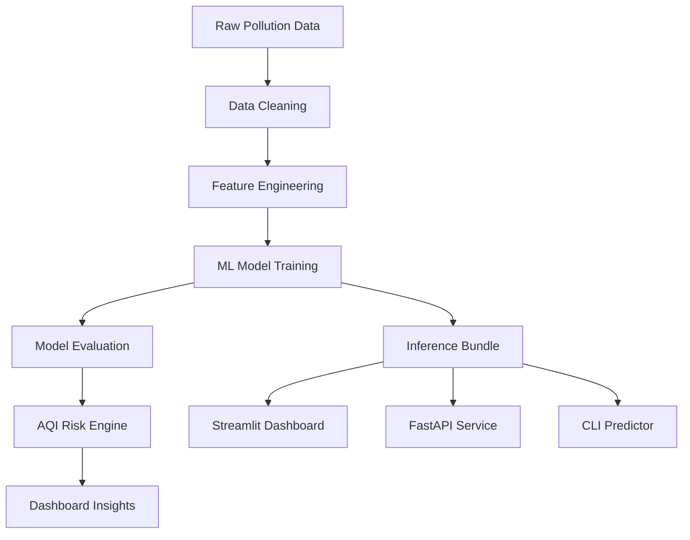

# AirSense AI - Air Pollution Forecasting & Risk Analytics Dashboard


## Overview

AirSense AI is an end-to-end machine learning dashboard that predicts PM2.5, PM10, and SO2 levels using multi-region air-quality monitoring data. It includes preprocessing, feature engineering, model evaluation, AQI risk interpretation, region-level analysis, explainability, anomaly detection, and a deployable dashboard/API layer.

This project is positioned as an **Air Pollution Forecasting & Risk Analytics System**, not just an air pollution detection notebook. It demonstrates practical AI engineering for environmental monitoring: converting messy raw DCR workbooks into a structured forecasting workflow, comparing baseline and boosted models, and presenting results through a professional monitoring dashboard.

## Why This Project

Air pollution forecasting is a realistic AI problem because pollutant levels depend on time, weather, recent concentration history, and local region behavior. A single notebook can show model training, but a complete AI system should also explain risk, compare strategies, detect unusual spikes, and present results in a way that a reviewer can understand quickly.

AirSense AI was built to demonstrate that complete workflow: raw data preparation, time-series feature engineering, model comparison, region-specific diagnosis, dashboard deployment, API serving, reports, and professional documentation.

## Key Highlights

- Processed `586,431` cleaned air-quality records.
- Trained the current runtime artifact on `467,188` quarter-hourly records after filtering spreadsheet-origin date artifacts.
- Engineered `202` lag, rolling, time, weather, and region features.
- Predicted `PM2.5`, `PM10`, and `SO2`.
- Improved global PM2.5 to R2 = `0.978` with LightGBM.
- Improved global PM10 to R2 = `0.883` with LightGBM.
- Achieved low SO2 MAE of `0.55`; SO2 RMSE remains spike-sensitive.
- Built a dashboard for prediction, model evaluation, risk insights, anomaly detection, and report generation.
- Added FastAPI, CLI prediction, Docker/Render deployment files, model reports, and tests.

## Model Improvement Summary

The first Random Forest report gave a useful baseline, but the boosted quarter-hourly run is the stronger final artifact. LightGBM improves PM2.5 and PM10 substantially, while XGBoost remains available for strategy comparison and wins selected SO2 region/target cases.

SO2 is the honest caveat: the boosted model reduces average absolute error, but RMSE and R2 remain sensitive to rare pollutant spikes. The final system therefore keeps region/target strategy selection and highlights SO2 spike monitoring as future work.

## Dashboard Features

The Streamlit dashboard uses sidebar navigation and a dark, modern layout.

- Overview
- Live Prediction
- Dataset Summary
- Global Model Performance
- Region-Specific Model Performance
- Region Analytics
- Feature Importance / SHAP-style Explainability
- Pollution Spike Detection
- AI-Generated Air Quality Summary
- Project Details

The static website in [`docs/`](docs/) provides a GitHub Pages-ready project presentation with forecast preview, results, explainability, anomaly detection, and report sections.

## Tech Stack

| Layer | Tools |
|---|---|
| Data processing | Python, Pandas, NumPy |
| Modeling | Scikit-learn, LightGBM, XGBoost, multi-output and single-target regression |
| Evaluation | RMSE, MAE, R2, chronological split, region-wise reports |
| Visualization | Matplotlib, Seaborn, Plotly, Streamlit charts |
| Dashboard | Streamlit |
| API | FastAPI |
| Artifact management | Joblib |
| Deployment | Docker, Render config, GitHub Pages |
| Notebook workflow | Google Colab |

## Project Workflow



## Dataset Summary

| Metric | Value | Interpretation |
|---|---:|---|
| Total cleaned records | 586,431 | Large processed dataset after cleaning |
| Quarter-hourly records | 467,188 | High-resolution raw monitoring data |
| Quarter-hourly records used by model | 467,188 | High-resolution modeling data |
| Regions processed | 4 | AIIMS, Bhatagaon, IGKV, Siltara |
| Forecast targets | 3 | PM2.5, PM10, SO2 |
| Engineered features | 202 | Lag, rolling, time, and region features |
| Test rows | 51,226 | Final evaluation sample size |

Insight: the dataset is large enough for a strong student-level predictive modeling project. The raw monitoring data was transformed into quarter-hourly machine-learning-ready features using cleaning, date-artifact filtering, lag features, rolling features, time encodings, and region indicators.

## Global Model Performance

| Target | Best Strategy | RMSE | MAE | R2 | Status | Interpretation |
|---|---|---:|---:|---:|---|---|
| PM2.5 | LightGBM boosted | 2.58 | 0.94 | 0.978 | Strong | Strong boosted forecasting performance |
| PM10 | LightGBM boosted | 14.87 | 3.07 | 0.883 | Strong | Large improvement over previous Random Forest baseline |
| SO2 | LightGBM boosted | 6.06 | 0.55 | 0.245 | Spike-sensitive | Low MAE but RMSE remains affected by SO2 spikes |

LightGBM outperformed XGBoost on the aggregate held-out leaderboard for this run. The final bundle keeps both candidate families and aliases `multi_output` / `single_target` to the best validation-selected boosted models.

## Baseline vs Boosted Comparison

| Target | Previous Random Forest R2 | Boosted R2 | RMSE Change | MAE Change | Result |
|---|---:|---:|---:|---:|---|
| PM2.5 | 0.044 | 0.978 | 76.62 -> 2.58 | 6.94 -> 0.94 | Major improvement |
| PM10 | 0.581 | 0.883 | 31.10 -> 14.87 | 18.29 -> 3.07 | Strong improvement |
| SO2 | 0.431 | 0.245 | 2.39 -> 6.06 | 1.26 -> 0.55 | Lower MAE, but spike-sensitive RMSE |

The comparison shows why the final artifact uses boosted trees. PM2.5 and PM10 improved decisively, while SO2 needs a separate spike-focused monitoring path because RMSE penalizes rare high-error events more heavily than MAE.

### Boosted Candidate Leaderboard

| Strategy | Mean RMSE | Mean MAE | Mean R2 | Notes |
|---|---:|---:|---:|---|
| `multi_output_lightgbm` | 7.84 | 1.52 | 0.702 | Best aggregate boosted candidate |
| `single_target_lightgbm` | 7.84 | 1.52 | 0.702 | Best single-target candidate |
| `multi_output_xgboost` | 8.05 | 1.58 | 0.695 | Competitive fallback candidate |
| `single_target_xgboost` | 8.05 | 1.58 | 0.695 | Useful for selected SO2 regions |
| `baseline_median` | 23.79 | 17.83 | -0.089 | Sanity-check baseline |

## Region-Specific Model Performance

| Region | Target | Best R2 | Performance Level | Notes |
|---|---|---:|---|---|
| AIIMS | PM2.5 | 0.984 | Strong | Boosted PM2.5 forecasting signal |
| IGKV | PM2.5 | 0.980 | Strong | Boosted PM2.5 forecasting signal |
| IGKV | PM10 | 0.975 | Strong | Boosted PM10 forecasting signal |
| AIIMS | PM10 | 0.969 | Strong | Boosted PM10 forecasting signal |
| SILTARA | PM10 | 0.935 | Strong | Industrial-region PM10 behavior |
| BHATAGAON | SO2 | 0.836 | Strong | Boosted SO2 forecasting signal |

Region-level results show that the boosted selector captures local short-term pollutant behavior well across monitoring regions. The selector is especially useful for SO2 because XGBoost wins some regional SO2 cases even though LightGBM is the strongest aggregate model.

## Final Modeling Strategy

| Target | Final Strategy | Reason |
|---|---|---|
| PM2.5 | Boosted LightGBM selector | LightGBM produced the best validation and held-out PM2.5 metrics. |
| PM10 | Boosted LightGBM selector | LightGBM produced the best validation and held-out PM10 metrics. |
| SO2 | Boosted LightGBM/XGBoost selector | SO2 has low MAE but spike-sensitive RMSE; XGBoost wins selected SO2 regions. |

The final system therefore uses a boosted strategy selector: LightGBM provides the best aggregate performance, XGBoost remains available for target/region comparison, and SO2 is monitored separately for spike-driven residual risk.

## How to Interpret the Results

| Area | Status | R2 | Explanation |
|---|---|---:|---|
| PM2.5 Global Forecasting | Strong | 0.978 | Boosted LightGBM captures short-term PM2.5 behavior strongly using lag, rolling, time, weather, and region features. |
| PM10 Global Forecasting | Strong | 0.883 | Boosted LightGBM substantially improves PM10 forecasting over the previous Random Forest result. |
| SO2 Global Forecasting | Spike-sensitive | 0.245 | SO2 MAE is low, but rare spikes still hurt RMSE and should be monitored. |

This analysis demonstrates model diagnosis and improvement strategy, not only model training.

## Visual Evidence

### Metric Comparison


### Best Strategy Heatmap


### Region Prediction Timeline


## Application Layer

The trained runtime is powered by one portable artifact:

```text
outputs/air_quality_models/models/inference_bundle.joblib
```

That artifact is reused by:

| Surface | File |
|---|---|
| Streamlit dashboard | [`app/streamlit_app.py`](app/streamlit_app.py) |
| FastAPI prediction service | [`app/api.py`](app/api.py) |
| CLI predictor | [`scripts/predict_cli.py`](scripts/predict_cli.py) |
| Shared inference package | [`airsense/inference.py`](airsense/inference.py) |

Set `AIRSENSE_MODEL_DIR` to choose which trained run to serve. By default, the runtime looks for `outputs/air_quality_models` first, then falls back to `outputs/smoke_air_quality_models`.

The final dashboard also includes a small utility source layer in [`src/`](src/) for configuration, AQI risk classification, hybrid model selection, anomaly detection, visualization helpers, preprocessing utilities, and rule-based AI report generation.

## Repository Structure

```text
docs/
  index.html
  styles.css
  app.js
  assets/

app.py

app/
  streamlit_app.py
  api.py

src/
  config.py
  aqi_utils.py
  anomaly_detection.py
  predict.py
  explainability.py
  report_generator.py
  visualization_utils.py
  preprocessing.py
  feature_engineering.py
  evaluate_models.py

airsense/
  aqi.py
  anomaly.py
  config.py
  data_ingestion.py
  evaluation.py
  explainability.py
  features.py
  inference.py
  modeling.py
  preprocessing.py

notebooks/
  air_pollution_prediction_colab.ipynb
  01_data_understanding.ipynb
  02_preprocessing_feature_engineering.ipynb
  03_global_model_training.ipynb
  04_region_specific_modeling.ipynb
  05_model_explainability.ipynb

scripts/
  prepare_combined_dataset.py
  train_air_quality_models.py
  predict_cli.py
  generate_reports.py
  smoke_test.py

data/
  data_dictionary.md
  raw/
  processed/
  sample/

models/
  global/
  region_specific/

outputs/
  .gitkeep

reports/
  global_metrics.csv
  region_metrics.csv
  model_comparison.csv
  final_results.json
  model_card.md
  experiment_report.md
  limitations_and_future_scope.md

assets/
  screenshots/
  charts/
  demo_images/

Dockerfile
DEPLOYMENT.md
render.yaml
PROJECT_REPORT.md
requirements.txt
README.md
```

## How to Run

### 1. Install dependencies

```powershell
python -m pip install -r requirements.txt
```

### 2. Prepare the combined dataset

```powershell
python scripts\prepare_combined_dataset.py `
  --zip "C:\Users\pruthviraj\Downloads\DCR AIIMS-20260606T154001Z-3-001.zip" `
  --zip "C:\Users\pruthviraj\Downloads\Bhatagaon DCR-20260606T153956Z-3-001.zip" `
  --zip "C:\Users\pruthviraj\Downloads\IGKV DCR-20260606T154005Z-3-001.zip" `
  --zip "C:\Users\pruthviraj\Downloads\SILTARA DCR-20260606T154006Z-3-001.zip"
```

### 3. Train the boosted model

```powershell
python scripts\train_air_quality_models.py `
  --granularity quarter_hourly `
  --output-dir outputs\air_quality_models `
  --model-families lightgbm xgboost `
  --n-jobs -1 `
  --gbm-n-estimators 220 `
  --gbm-learning-rate 0.05 `
  --gbm-max-depth 7 `
  --gbm-subsample 0.9 `
  --gbm-colsample 0.9
```

### 4. Run the dashboard

```powershell
streamlit run app.py
```

Alternative local entry point:

```powershell
streamlit run app\streamlit_app.py
```

### 5. Run the API

```powershell
uvicorn app.api:app --host 0.0.0.0 --port 8000
```

### 6. Run a CLI prediction

```powershell
python scripts\predict_cli.py --region SILTARA --pm25 78 --pm10 145 --so2 14 --temp 31 --hum 62 --ws 3.2
```

### 7. Run tests

```powershell
python -m pytest -q tests
```

## Deployment

The repository includes a root [`app.py`](app.py) entry point for Streamlit Cloud, a [`Dockerfile`](Dockerfile), and [`render.yaml`](render.yaml) for Render-style deployment. For Streamlit Cloud, select this repository and use:

```text
app.py
```

## API Example

```powershell
Invoke-RestMethod `
  -Method Post `
  -Uri http://127.0.0.1:8000/predict `
  -ContentType "application/json" `
  -Body '{"region":"SILTARA","pm25":78,"pm10":145,"so2":14,"temperature":31,"humidity":62,"wind_speed":3.2,"timestamp":"2026-06-08T09:00:00"}'
```

## Colab Final Training

Use [`notebooks/air_pollution_prediction_colab.ipynb`](notebooks/air_pollution_prediction_colab.ipynb) for the full data-heavy run.

Recommended boosted training command:

```powershell
python scripts\train_air_quality_models.py `
  --granularity quarter_hourly `
  --output-dir outputs\air_quality_models `
  --model-families lightgbm xgboost `
  --n-jobs -1 `
  --gbm-n-estimators 220 `
  --gbm-learning-rate 0.05 `
  --gbm-max-depth 7 `
  --gbm-subsample 0.9 `
  --gbm-colsample 0.9
```

Recommended workflow:

1. Upload the four raw DCR zip files.
2. Run dataset preparation.
3. Train the quarter-hourly boosted model.
4. Export plots from `outputs/air_quality_models/plots/`.
5. Replace the images in `docs/assets/`.
6. Point `AIRSENSE_MODEL_DIR` at `outputs/air_quality_models`.

## Project Details

### Problem

Air pollution monitoring data is messy, time-dependent, and region-specific. Manual analysis makes it difficult to forecast pollutant levels and understand environmental risk.

### Solution

AirSense AI cleans raw pollution data, engineers time-series features, trains forecasting models, evaluates global and region-wise performance, detects spikes, and presents insights through a dashboard and API.

### ML Concepts

- Regression
- Time-series feature engineering
- Lag features
- Rolling statistics
- Region encoding
- Model evaluation
- Error analysis
- Explainability
- Anomaly detection

### Limitations

- SO2 RMSE remains sensitive to rare spikes even when MAE is low.
- The trainer filters spreadsheet-origin timestamp artifacts before 2022-01-01.
- More weather, emission-source, and event features can improve spike forecasting.
- AQI risk interpretation is a simplified project-level layer.

### Future Scope

- Real-time pollution board API integration
- 24-hour forecasting
- Explicit SO2 spike and residual modeling
- Geospatial heatmap
- LLM-based report generation
- Email or WhatsApp alerts
- Model monitoring and retraining

## Conclusion

AirSense AI is an end-to-end air pollution forecasting dashboard. I processed 586,431 cleaned records from four monitoring regions and engineered 202 features for predicting PM2.5, PM10, and SO2. The boosted quarter-hourly LightGBM run achieved held-out R2 of 0.978 for PM2.5 and 0.883 for PM10, while SO2 reached low MAE of 0.55 but remains spike-sensitive. The dashboard presents these results with AQI risk interpretation, anomaly detection, and explainability so the project works like an AI monitoring product instead of just a notebook.

## Notes

- AQI interpretation is a simplified project-level risk layer and not an official regulatory AQI calculation.
- Spike detection is based on statistical deviation from recent trends and should be verified with official monitoring systems.
- The report generator uses a rule-based NLP-style summarization template and can be upgraded with an LLM-based summarizer.
- Large raw and processed datasets are excluded from Git and can be regenerated with the provided pipeline.
