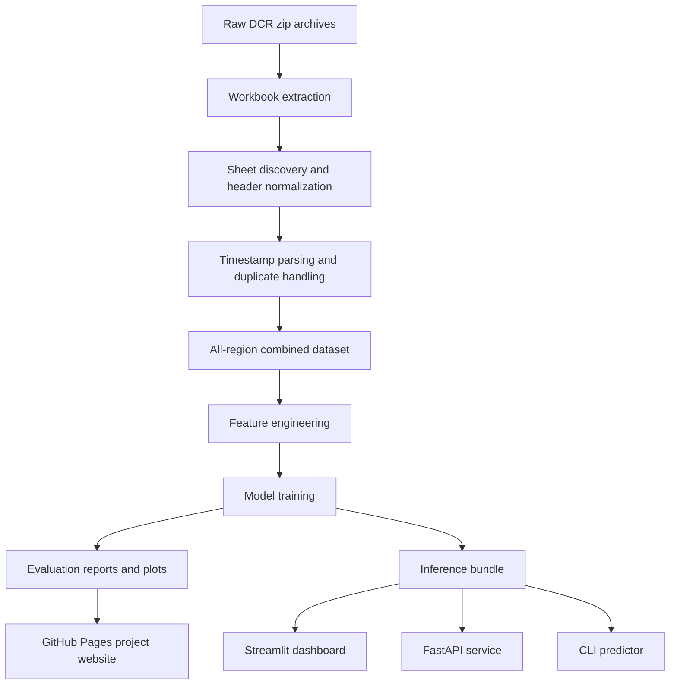

# AirSense AI

## Multi-Region Air Quality Forecasting and Risk Intelligence


AirSense AI is a complete machine-learning project that converts real multi-region air-quality monitoring workbooks into a deployable forecasting and risk-intelligence system.

The project cleans raw DCR files from four Raipur monitoring regions, builds a combined time-series dataset, engineers leakage-safe forecasting features, trains models for `PM2.5`, `PM10`, and `SO2`, explains predictions, detects pollution spikes, and serves the result through a professional website, Streamlit dashboard, FastAPI service, and CLI predictor.

## Live Website

The GitHub Pages-ready website is in [`docs/`](docs/).

Expected public URL after GitHub Pages is enabled from the `docs/` folder:

```text
https://pruthvi226.github.io/Air_Pollution_Detection_ML/
```

Local static preview:

```text
docs/index.html
```

Streamlit dashboard:

```powershell
streamlit run app\streamlit_app.py
```

## Project Snapshot

| Area | What was built |
|---|---|
| Data engineering | Raw DCR zip/workbook extraction, sheet parsing, timestamp normalization, duplicate handling, and all-region merge |
| Forecasting | Next-step prediction for `PM2.5`, `PM10`, and `SO2` |
| Feature engineering | Time features, cyclic encodings, lag features, rolling means, rolling standard deviations, region indicators |
| Evaluation | Chronological train/validation/test split, RMSE, MAE, R2, region-wise metrics, plots, reports |
| Risk layer | AQI-style category, health recommendation, and pollutant driver summary |
| Anomaly layer | Spike detection for elevated PM2.5, PM10, and SO2 scenarios |
| Explainability | Tree feature-importance summaries with graceful fallback if optional SHAP tooling is unavailable |
| Applications | Streamlit dashboard, FastAPI API, CLI predictor, GitHub Pages website |
| Deployment | Dockerfile, Render config, reusable model artifact, Colab notebook, tests |

## What We Have Done

- Built a reproducible pipeline for inconsistent `.xlsx`, `.xls`, and `.xlsb` DCR workbooks.
- Combined four regional monitoring datasets into one modeling-ready dataset.
- Created a structured `airsense/` Python package for AQI logic, anomaly detection, inference, feature engineering, explainability, preprocessing, and modeling.
- Trained baseline, multi-output, and single-target forecasting models.
- Exported a portable `inference_bundle.joblib` artifact used by every runtime surface.
- Added a Streamlit dashboard with:
  - Overview
  - Live Prediction
  - Region Analytics
  - Model Performance
  - Explainability
  - Anomaly Detection
  - AI Report
  - Project Details
- Added a FastAPI app with:
  - `/health`
  - `/metadata`
  - `/predict`
- Added a CLI prediction script for terminal checks.
- Added reports, model card, limitations, experiment summary, and deployment documentation.
- Built a professional GitHub Pages website in `docs/`.
- Added automated tests for important runtime behavior.

## System Architecture



## Data Coverage

The combined dataset was prepared from four supplied DCR regional archives.

| Region | Total rows | Hourly rows | Quarter-hourly rows |
|---|---:|---:|---:|
| AIIMS | 154,109 | 30,000 | 124,109 |
| Bhatagaon | 147,966 | 29,395 | 118,571 |
| IGKV | 151,801 | 29,891 | 121,910 |
| SILTARA | 132,555 | 29,957 | 102,598 |

Overall dataset:

| Metric | Value |
|---|---:|
| Total cleaned rows | 586,431 |
| Quarter-hourly rows | 467,188 |
| Hourly rows | 119,243 |
| Regions | 4 |
| Forecast targets | 3 |
| Engineered model features | 201 |

Large raw and processed datasets are intentionally excluded from Git. Recreate them locally or in Colab with the provided scripts.

## Modeling Approach

### Targets

- `pm2_5`
- `pm10`
- `so2`

### Feature Families

- Current pollutant readings
- Weather readings
- Date and time features
- Cyclic hour, minute, weekday, month, and day-of-year encodings
- Lag features
- Rolling mean features
- Rolling standard deviation features
- Region one-hot indicators
- Missing-value indicators through model imputation

### Model Strategies

| Strategy | Purpose |
|---|---|
| `baseline_median` | Simple benchmark to prove model lift over a naive baseline |
| `multi_output` | One model predicts PM2.5, PM10, and SO2 together |
| `single_target` | Separate model per pollutant |
| `best` | Inference-time strategy selection by region and target |

### Evaluation Design

- Chronological split to reduce time-series leakage
- Train, validation, and test reports
- Overall metrics by target
- Region-wise metrics by target
- Model comparison leaderboard
- Prediction plots and scatter plots
- Reusable JSON and CSV reports

## Application Layer

The trained runtime is powered by one portable artifact:

```text
outputs/<run>/models/inference_bundle.joblib
```

That artifact is reused by:

| Surface | File |
|---|---|
| Streamlit dashboard | [`app/streamlit_app.py`](app/streamlit_app.py) |
| FastAPI prediction service | [`app/api.py`](app/api.py) |
| CLI predictor | [`scripts/predict_cli.py`](scripts/predict_cli.py) |
| Shared inference package | [`airsense/inference.py`](airsense/inference.py) |

Set `AIRSENSE_MODEL_DIR` to choose which trained run to serve. By default, the runtime looks for `outputs/air_quality_models` first, then falls back to `outputs/smoke_air_quality_models`.

## Website and Dashboard

The project includes two user-facing experiences.

### GitHub Pages Website

The static website in [`docs/`](docs/) includes:

- Live forecast preview
- Dataset summary
- Data and modeling pipeline
- Model result plots
- Explainability section
- Anomaly detection section
- AI report preview
- Project capability mapping

### Streamlit Dashboard

The dashboard is the interactive application layer for local or deployed use:

- Live Prediction with scenario loading
- AQI-style risk cards
- Region analytics
- Model performance tables and plots
- Feature-importance explainability
- Anomaly review
- Downloadable AI report
- Project details and capability mapping

## Visual Evidence

### Metric Comparison


### Best Strategy Heatmap


### Region Prediction Timeline


## Repository Structure

```text
docs/
  index.html
  styles.css
  app.js
  assets/

app/
  streamlit_app.py
  api.py

airsense/
  aqi.py
  anomaly.py
  config.py
  data_ingestion.py
  evaluation.py
  explainability.py
  features.py
  inference.py
  modeling.py
  preprocessing.py

notebooks/
  air_pollution_prediction_colab.ipynb

scripts/
  prepare_combined_dataset.py
  train_air_quality_models.py
  predict_cli.py
  generate_reports.py
  smoke_test.py

data/
  data_dictionary.md
  sample/

outputs/
  .gitkeep

reports/
  model_card.md
  experiment_report.md
  limitations_and_future_scope.md

Dockerfile
DEPLOYMENT.md
render.yaml
requirements.txt
README.md
```

## Quick Start

### 1. Install dependencies

```powershell
python -m pip install -r requirements.txt
```

### 2. Build the combined dataset

```powershell
python scripts\prepare_combined_dataset.py `
  --zip "C:\Users\pruthviraj\Downloads\DCR AIIMS-20260606T154001Z-3-001.zip" `
  --zip "C:\Users\pruthviraj\Downloads\Bhatagaon DCR-20260606T153956Z-3-001.zip" `
  --zip "C:\Users\pruthviraj\Downloads\IGKV DCR-20260606T154005Z-3-001.zip" `
  --zip "C:\Users\pruthviraj\Downloads\SILTARA DCR-20260606T154006Z-3-001.zip"
```

### 3. Train a fast local model

```powershell
python scripts\train_air_quality_models.py `
  --granularity hourly `
  --n-estimators 10 `
  --max-depth 8 `
  --max-samples 0.15 `
  --n-jobs 1
```

### 4. Run the Streamlit dashboard

```powershell
streamlit run app\streamlit_app.py
```

### 5. Run the FastAPI service

```powershell
uvicorn app.api:app --host 0.0.0.0 --port 8000
```

### 6. Run a CLI prediction

```powershell
python scripts\predict_cli.py --region SILTARA --pm25 78 --pm10 145 --so2 14 --temp 31 --hum 62 --ws 2.1
```

### 7. Run tests

```powershell
python -m pytest -q tests
```

## API Example

```powershell
Invoke-RestMethod `
  -Method Post `
  -Uri http://127.0.0.1:8000/predict `
  -ContentType "application/json" `
  -Body '{"region":"SILTARA","pm25":78,"pm10":145,"so2":14,"temperature":31,"humidity":62,"wind_speed":2.1,"timestamp":"2026-06-08T08:00:00"}'
```

## Colab Final Training

Use [`notebooks/air_pollution_prediction_colab.ipynb`](notebooks/air_pollution_prediction_colab.ipynb) for the full data-heavy run.

Recommended final training command:

```powershell
python scripts\train_air_quality_models.py `
  --granularity quarter_hourly `
  --n-estimators 140 `
  --max-depth 18 `
  --max-samples 0.35 `
  --n-jobs -1
```

Recommended final workflow:

1. Upload the four raw DCR zip files.
2. Run dataset preparation.
3. Train the quarter-hourly model.
4. Export plots from `outputs/air_quality_models/plots/`.
5. Replace the images in `docs/assets/`.
6. Point `AIRSENSE_MODEL_DIR` at `outputs/air_quality_models`.

## Deployment

This repository includes:

- `Dockerfile`
- `render.yaml`
- `DEPLOYMENT.md`
- Streamlit app
- FastAPI app
- GitHub Pages static website

Typical deployment surfaces:

| Target | Use |
|---|---|
| GitHub Pages | Static website from `docs/` |
| Streamlit Community Cloud or local Streamlit | Dashboard |
| Render | FastAPI service |
| Docker | Portable app packaging |
| Colab | Full training workflow |

## Project Strengths

- Handles messy, real-world environmental monitoring files.
- Shows end-to-end ML work, not only notebook modeling.
- Uses chronological evaluation for time-series validation.
- Packages inference once and reuses it across dashboard, API, and CLI.
- Includes clear model documentation, limitations, tests, and deployment files.
- Displays results through a professional website and dashboard.

## Validation Results

The current repository includes an hourly runtime artifact used to validate the full modeling and application workflow. The pipeline also supports a higher-resolution quarter-hourly training run through the Colab workflow.

### Dataset Summary

| Result | Value |
|---|---:|
| Total cleaned records | 586,431 |
| Quarter-hourly records | 467,188 |
| Hourly records used by current model | 119,243 |
| Regions processed | 4 |
| Forecast targets | 3 |
| Engineered features | 201 |
| Test rows in current hourly artifact | 15,772 |

### Overall Test Metrics

| Target | Best strategy | RMSE | MAE | R2 |
|---|---|---:|---:|---:|
| PM10 | Single-target | 31.10 | 18.29 | 0.581 |
| SO2 | Single-target | 2.39 | 1.26 | 0.431 |
| PM2.5 | Multi-output | 76.62 | 6.94 | 0.044 |

### Best Region-Level Results

| Region | Target | Best R2 | Notes |
|---|---|---:|---|
| IGKV | PM2.5 | 0.840 | Clean-region PM2.5 forecasting signal |
| AIIMS | PM2.5 | 0.819 | Medical/residential PM2.5 forecasting signal |
| IGKV | PM10 | 0.769 | Cleaner baseline PM10 behavior |
| AIIMS | PM10 | 0.742 | Mixed urban PM10 behavior |
| SILTARA | PM2.5 | 0.585 | Industrial-region PM2.5 behavior |
| AIIMS | SO2 | 0.502 | Region-level SO2 behavior |

## Current Scope and Roadmap

The project is complete as an end-to-end ML system and ready to demonstrate the full workflow:

- Real-world data ingestion and cleaning
- Multi-region time-series feature engineering
- Forecasting model with proper chronological evaluation
- AQI-style risk interpretation
- Anomaly detection
- Explainability
- Streamlit dashboard
- FastAPI endpoint
- CLI predictor
- GitHub Pages website
- Deployment-ready structure

Planned model-quality upgrades:

- Run the full quarter-hourly training workflow in Colab.
- Refresh the website plots with final quarter-hourly artifacts.
- Add region-specific residual analysis for PM2.5.
- Add outlier review and treatment for sensor spikes.
- Compare Random Forest with gradient boosting models for the final artifact.

## Notes

- The bundled runtime artifact is optimized for local validation and application readiness.
- AQI-style categories are project risk labels, not certified regulatory AQI or medical advice.
- Large raw and processed datasets are excluded from Git and can be regenerated with the provided pipeline.
